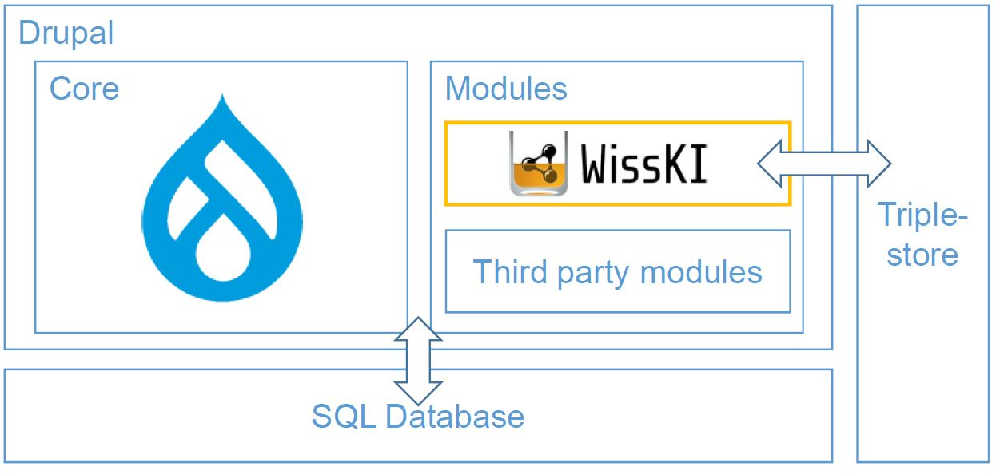

<!--

icon: https://raw.githubusercontent.com/chastik/Beratung_Dateityp_Bild/refs/heads/main/SODa-Logo_full.svg
link: https://raw.githubusercontent.com/chastik/Beratung/refs/heads/main/soda.css

-->

# SODa WissKI-ISWC25 Bits

**ENTWICKELN UND IMPLEMENTIEREN SIE IHR DATENMODELL**  

Von der Sammlung zum Diagramm – verstehen und erklären

---

## Einheit 3: WissKI in Kürze  

**Kurze Einführung in WissKI und seine Architektur**  

**Dauer:** ~ 5 Min.

---

## WissKI in Kürze

**WissKI** (Wissenschaftliche Kommunikations-Infrastruktur) ist:

* eine freie, quelloffene virtuelle Forschungsumgebung
* entwickelt für Kulturerbe- und Forschungsdaten
* basierend auf Semantic-Web-Technologien
* modular aufgebaut und standardorientiert.

WissKI wird u.a. am **Germanischen Nationalmuseum (GNM)** in Nürnberg eingesetzt —

* dem größten kulturhistorischen Museum im deutschsprachigen Raum
* das Maßstäbe für digitale Forschungsinfrastrukturen setzt.

WissKI ist **nicht nur** eine Sammlungsdatenbank –  es ist ein **semantisches Datenmanagementsystem für Linked Open Data (LOD)**  und unterstützt die FAIR-Prinzipien (
**Findable – Accessible – Interoperable – Reusable**)

---

## WissKI und Drupal 10

WissKI ist **keine eigenständige Software**.  

Es ist eine **semantische Erweiterung** des Content-Management-Systems **Drupal 10**.

| Drupal stellt bereit …       | WissKI ergänzt …                        |
|-----------------------------|------------------------------------------|
| Benutzer- & Rollenverwaltung | Semantische Modellierung mit Ontologien  |
| Modulares Framework         | Pathbuilder für semantische Pfade        |
| REST- & JSON-Schnittstellen | RDF Triple-Store                  |
| Zugriffskontrolle           | SPARQL-Endpunkt                          |
| Mehrsprachige Oberfläche    | Veröffentlichung als Linked Open Data (LoD)    |

---

## Der WissKI Pathbuilder

Der **Pathbuilder** ist das **Herzstück von WissKI**.

WissKI arbeitet **nicht mit Tabellen**, sondern mit **ontologiebasierten Strukturen**.

Der Pathbuilder definiert:

* **Gruppen** → semantische Entitäten, z. B. Objekt, Person, Ort, Ereignis  
* **Pfade** → Beziehungen diese Entitäten, z. B. Objekt → wurde geschaffen von → Person  
* **Widgets** → automatisch generierte Eingabeformulare, deren Struktur aus der Semantik abgeleitet wird

So bleibt WissKI flexibel, ermöglicht semantische Konsistenz und ist in der Datenpflege bestmöglich Nutzendenunterstützend.

---

## Semantisches Modellieren auf *WissKI-Art*

In WissKI werden  **nicht nur Daten** gespeichert und erfasst, sondern **Bedeutung** modelliert.

Leitfrage:

> **Welche reale Beziehung besteht zwischen den Dingen?**

Beispiel aus dem Video:

* **Albrecht Dürer** → Person  
* wurde geboren in → **Nürnberg** (Ort)  
* zu → **einem bestimmten Zeitpunkt**  
* hatte eine Mutter → **Barbara Dürerin** (Person)  
* schuf → **Selbstbildnis** (Objekt)
* **Entstehungszeitpunkt** in einer **Quelle** erwähnt
* während → **seiner künstlerischen Schaffensperiode**  
* in → **Nürnberg**

Diese semantischen Bedeutungsaussagen lassen **einen Wissensgraphen** entstehen, ein Netzwerk verbundenen Informationen.

(Video: `../assets/semanticModelling.mp4`)

---

## Vorteile von WissKI

* ermöglicht **wissensbasierte Modellierung** statt starrer Tabellenschemata
* stellt **Interoperabilität** durch etablierte Ontologien wie **CIDOC CRM** sicher
* unterstützt die **FAIR-Prinzipien**
* generiert **Eingabeformulare automatisch** auf Basis semantischer Pfade
* publiziert Daten als **Linked Open Data**
* bietet **leistungsfähige SPARQL-Abfragen**
* verbindet **konzeptionelle Klarheit** mit **technischer Umsetzung**.

---

## Die Semantik zentral in WissKi

* **CIDOC CRM** definiert Konzepte & Beziehungen  
* **Semantische Pfade** bilden die Datenstruktur 
* **Formulare** erzwingen konsistente Dateneingabe  
* **RDF-Wissensgraph** ermöglicht Austausch & LOD-Publikation

