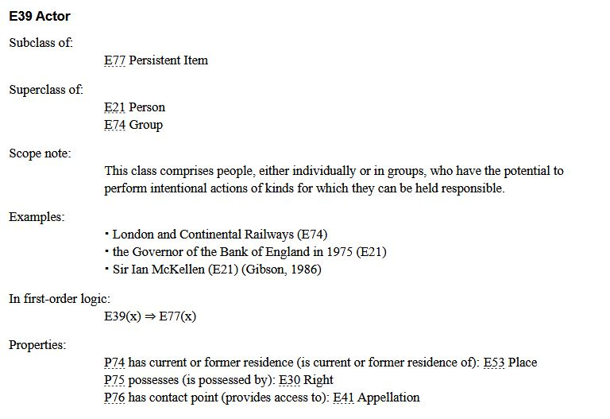

<!-- 

icon: https://raw.githubusercontent.com/chastik/Beratung_Dateityp_Bild/refs/heads/main/SODa-Logo_full.svg 
link: https://raw.githubusercontent.com/chastik/Beratung/refs/heads/main/soda.css 

-->

# SODa WissKI-ISWC25 Bits

**ENTWICKELN UND IMPLEMENTIEREN SIE IHR DATENMODELL**  

Von der Sammlung zum Diagramm – verstehen und erklären

---

## Einheit 4: CIDOC CRM und Domänenontologien

**Warum CIDOC CRM als zugrunde liegende Ontologie?**  

**Dauer:** ~ 15 Min.

---

## Warum verwenden wir Ontologien?

Bei der Modellierung von Forschungsdaten aus den Geistes- und Kulturwissenschaften – geht es nicht nur darum, Daten zu beschreiben.

Ontologien helfen dabei:

* **Semantische Beziehungen auszudrücken**
* **Wissen maschinenlesbar zu machen**
* **Interoperabilität zwischen Einrichtungen und Systemen sicherzustellen**
* **Daten mit dem Linked Open Data-Ökosystem zu verbinden**
* **Kontext und Provenienz zu erhalten**.

---

## Was ist CIDOC CRM?

[CIDOC CRM](https://cidoc-crm.org/) ist eine **ISO-zertifizierte Ontologie (ISO 21127)**, entwickelt vom **CIDOC-Komitee der ICOM (International Council of Museums)**.

Sie wurde speziell für die **Dokumentation kulturellen Erbes** entwickelt und konzentriert sich auf:

* Ereignisse  
* Personen  
* Objekte  
* Orte  
* Zeiträume  
* und deren **semantische Beziehungen**

**Kurz gesagt:**  

CIDOC CRM bietet einen **gemeinsamen konzeptuellen Rahmen**, um kulturelle Informationen **verständlich und interoperabel** zu beschreiben.

WissKI verwendet die **CIDOC CRM OWL-Ontologie** als Grundlage, kann jedoch **zusätzliche Ontologien einbinden**.

---

## Zentrale Konzepte in CIDOC CRM

CIDOC CRM ist **ereigniszentriert**, d.h. es beschreibt nicht nur, *was etwas ist*, sondern **was mit ihm passiert**.

| Dimension          | Beispielklasse             | Bedeutung                                |
|-------------------|----------------------------|-------------------------------------------|
| Ding              | **E70 Thing**              | Physisches oder immaterielles Objekt      |
| Physisches Objekt | **E22 Human-Made Object**  | Artefakt, Exponat, Sammlungsobjekt        |
| Akteur            | **E21 Person**, **E74 Group** | Individuum oder Organisation           |
| Ereignis          | **E5 Event**               | Eine Handlung oder Veränderung            |
| Ort               | **E53 Place**              | Räumlicher Kontext                         |
| Zeit              | **E52 Time-Span**          | Zeitlicher Rahmen                          |

---

## Klassenhierarchie und Scope Notes

Die **Scope Note** einer CIDOC CRM-Klasse legt fest:

* **Was sie ausdrückt**
* **Welche Bedeutung und Grenzen sie hat**
* **Wann sie verwendet werden sollte**

Nicht entscheidend sind:

* der Name der Klasse,
* ihre hierarchische Position,
* oder intuitive Assoziationen.

**Scope Notes sind maßgeblich für die korrekte Modellierung.**

---

## Modellierungsstrategie im Tutorial

Es gibt verschiedene Ansätze, Domänenontologien zu erweitern:

* Neue **Subklassen** bilden
* Neue **Eigenschaften** definieren
* **Reine Wiederverwendung** bestehender CIDOC CRM-Klassen und -Eigenschaften
* **Kombinationen** der oben genannten Strategien

In diesem Tutorial wird eine **leichtgewichtige Erweiterungsstrategie** empfohlen:

→ **Domänenspezifische Unterklassen, wenn erforderlich**  
→ **Eigenschaften werden weitestgehend aus CIDOC CRM übernommen**

Das garantiert **Interoperabilität und CIDOC-Kompatibilität** und reduziert die Komplexität.

---

## Bedeutung ausdrücken mit CIDOC CRM

**Beispiel: Zelda-Spiel (SNES)**

*Das Videospiel „The Legend of Zelda: A Link to the Past“ wurde 1991 von Nintendo in Japan produziert.*

| Natürliche Aussage | CIDOC CRM-Repräsentation |
|--------------------|--------------------------|
| Das Spiel ist ein Objekt | **E22 Human-Made Object** |
| Titel: *The Legend of Zelda: A Link to the Past* | **E22** → *has title* → **E35 Title** |
| Es wurde hergestellt | **E65 Creation** |
| Hersteller ist Nintendo | **E65 Creation** → *carried out by* → **E74 Group (Nintendo)** |
| Produktionsort ist Kyoto | *took place at* → **E53 Place (Kyoto)** |
| Jahr: 1991 | *has time-span* → **E52 Time-Span (1991)** |

---

### Beispiel: Vase

| Natürliche Beschreibung | CIDOC CRM Repräsentation |
|-------------------------|--------------------------|
| Die Vase ist ein Artefakt | **E22 Human-Made Object** |
| Sie wurde in einer Ausgrabung gefunden | **E5 Event** (Excavation) |
| Das Team führte die Grabung durch | *carried out by* → **E74 Group** |
| Die Grabung fand in Nara statt | *took place at* → **E53 Place** |
| Jahr: 2005 | *has time-span* → **E52 Time-Span** |

---

## Top-Level- vs. Domänenontologien

| Top-Level Ontologie (Grundstruktur) | Domänenontologie (Fachspezifik) |
|------------------------------------|---------------------------------|
| z. B. **CIDOC CRM** | Erweiterungen wie MEGA, WissKI-Profile etc. |
| Definiert grundlegende Kategorien | Beschreibt disziplinäre Detailkonzepte |
| sorgt für Interoperabilität | erhöht Präzision |
| langfristig stabil | anpassbar an Forschungsbedarfe |

Eine **zweistufige Modellierungsstrategie** unterstützt:

* Semantische Klarheit
* Interoperabilität
* Erweiterbarkeit
* Nachhaltigkeit

---

## Relevanz und Nutzen von CIDOC CRM 

WissKI nutzt CIDOC CRM, weil es …

* **eindeutige, maschinenlesbare Bedeutungen** schafft
* **Begriffsmehrdeutigkeit und Datenisolierung** vermeidet
* **institutionenübergreifende Interoperabilität** ermöglicht
* **Ereignisse, Prozesse und Provenienz** systematisch abbildet
* **FAIR & Linked Open Data** unterstützt
* **robustes Fundament** für Wissensgraphen bietet 
* sich vollständig in den **WissKI Pathbuilder** integrieren lässt.

