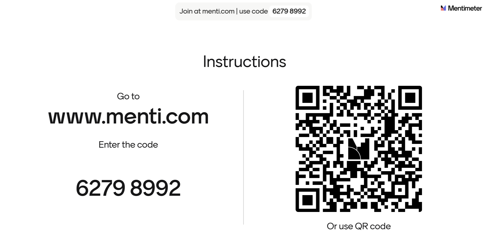

<!--
*titel:
*author:in/urheber:in: 
orcid: 
email: SODa@sammlungen.io
*lizenz: cc by
lizenzlink: https://creativecommons.org/
*persistenter OER link: 
language: 
version:  v1
beschreibung: 
format: SODa WissKI How-to-Tutorial
modultitel: 
modul: Unit 1
einheitstitel: Welcome and warm-up 
eiheit: Einheit 1
lernziel: 

baustein:
zielgruppe: https://zenodo.org/records/15574575
gestaltungsprinzip: 
keywords: ???
erstellungsdatum: 

technische metadaten:
medientyp: text
dateiformat: .md
dauer: 
größe:
software: Web

icon: /assets/SODa-Logo_full.svg

link: https://raw.githubusercontent.com/chastik/WissKI/refs/heads/main/soda.css

-->

# SODa WissKI-ISWC25 Bits

**DEVELOP AND IMPLEMENT YOUR DATA MODEL** 

From collection to diagram - understanding and explaining

**Unit 1: Welcome and Warm-up**

Duration: ~ 15 Min.

    {{|>}}
> Good morning, and welcome to our tutorial **SODa WissKI Bits: Ontology-driven Research Data Modeling** here at International Semantic Web Conference (ISWC) 2025 in Nara. 
> My name is **Canan**, and I will guide you today through a hands-on exploration of WissKI, a virtual research environment for GLAMs (Gallery, Library, Archive, and Museum) institutions and their collections.
> This tutorial follows a **learning-by-doing approach**. That means we will not only discuss ontology-based data modeling – we will work with real data and model step by step together.

## Session Outline 

** Session 1: 9:00 am - 10:30 am**

* Unit 1 Welcome and warm-up (15 Min.)

Introduction to the tutorial objectives and schedule and short participant interaction.

* Unit 2 Orientation (5 Min.)

Overview of the workflow from data analysis to semantic modeling.

* Unit 3 WissKI in a nutshell (15 Min.)

Short introduction to WissKI, its architecture, and CIDOC CRM as underlying ontology.

* Unit 4 CIDOC CRM and Domain Ontologies (10 Min.)

Why CIDOC CRM as an underlying ontology?

* Unit 5 Identify core entities from a collection (20 Min.)

Joint exploration of a sample collection using the MEGA domain ontology.

* Unit 6 Live-Demo in Protegé (10 Min.)

Integration of a Modular Extension into an Existing Knowledge Model

* Unit 7 Group discussion and feedback (15 Min.)

Participants provide feedback on the workflow and reflect on the relevance and clarity of the conceptual modeling process.

## About the SODa Project

My colleagues and I are members of the [SODa project team](https://sammlungen.io/projekt).

**SODa** advances sustainable infrastructures for research data and scientific collections and strengthens data literacy and data science expertise in collection-based research. 

Across Germany, more than 1,200 scientific collections preserve and provide access to valuable research materials — from zoology and mineralogy to botany, archaeology, and game studies, and more. 

These scientific collections constitute a vital foundation for... 

* research-based knowledge production,
* disciplinary development,
* and academic teaching.

But they also require structured and interoperable data management to stay sustainable. 

This is exactly where **WissKI and ontology-based data modeling** can support real research workflows.

## About the Team

Together with my colleagues **Gudrun** and **Mark**, we designed this tutorial.

<table>
  <tr>
    <td></td>
    <td></td>
     </tr>
</table>

We were supported by **Elias**. 

 <table>
  <tr>
    <td></td>
  </tr>
</table>

Elias developed a pipeline that converts conceptual semantic diagrams from draw.io into semantic paths as XML files for WissKI Pathbuilder.

This allows us to generate application profiles automatically and keep the underlying ontology consistent.

## Objectives

By the end of this tutorial, you will:  

| You will be able to...                                   | Learning Outcome                                                                                                                                      |
|----------------------------------------------------------|-------------------------------------------------------------------------------------------------------------------------------------------------------|
| **Understand ontology-based data modeling with WissKI**  | • use ontologies to describe resources (`LZ-ID 03_007_0780`) • evaluate the suitability of different database systems (`LZ-ID 02_010_0407`)        |
| **Analyze and structure domain collections**             | • analyze an existing WissKI collection (Analyzing) • apply a data curation concept considering semantic modeling & FAIR (`LZ-ID 02_016_0567`)     |
| **Build semantic paths and simple knowledge graphs**     | • use WissKI Pathbuilder to model groups and paths (`LZ-ID 03_dataModeling_soda0001`) • verify groups and paths (`LZ-ID 03_dataModeling_soda0006`) |
| **Reflect on semantic modeling practices and challenges**| • independently analyze metadata standards (`LZ-ID 03_003_0657`) • identify quality criteria for controlled vocabularies (`LZ-ID 03_005_0717`)     |

## Before we continue, I would like to hear from your expectations and experiences

* What do you expect to gain from this tutorial today?
* What brings you to ISWC 2025? What are you currently working on?
* What’s your experience with semantic modeling? 
* What challenges have you faced so far?

To better understand your expectations and level of experience, I invite you to join a short interactive Mentimeter survey.

**How to**

* Please open Mentimeter via the provided following link and enter the code **or** to join the survey session by using the QRcode. 
* Once everyone is in, I’ll open the questions one by one — please answer step by step. 
* We will wait until everyone has answered before moving on.
* This survey is anonymous and no personal data will be collected!
* Thank you for participating!

 <table>
    <tr>
      <td></td>
    </tr>
</table>

## Speed Dating Warm-Up

To activate the room and build connections, we will start with a quick speed networking round. so let’s make some connections across cultures and backgrounds. 

Introductions:

1. Please find a person near you — ideally someone you haven't spoken to yet.
2. You will interview each other using three quick questions.
3. Each round lasts only 30 seconds per person.
4. After each round: switch partners.
5. Then please go to another person.

**Questions to Ask Each Other**

* What’s your name and where are you from?
* Which languages do you speak?
* Tell me one fun fact about yourself – academic or random!

**Fun fact examples – everything counts!**

* You once tried to model your kitchen in OWL.
* Your pet is named *SPARQL*.
* You collect Japanese Whisky, Capsule Toys, Pokémon Trading Cards... 

**Ready? Let’s go — starting with your first partner!**
