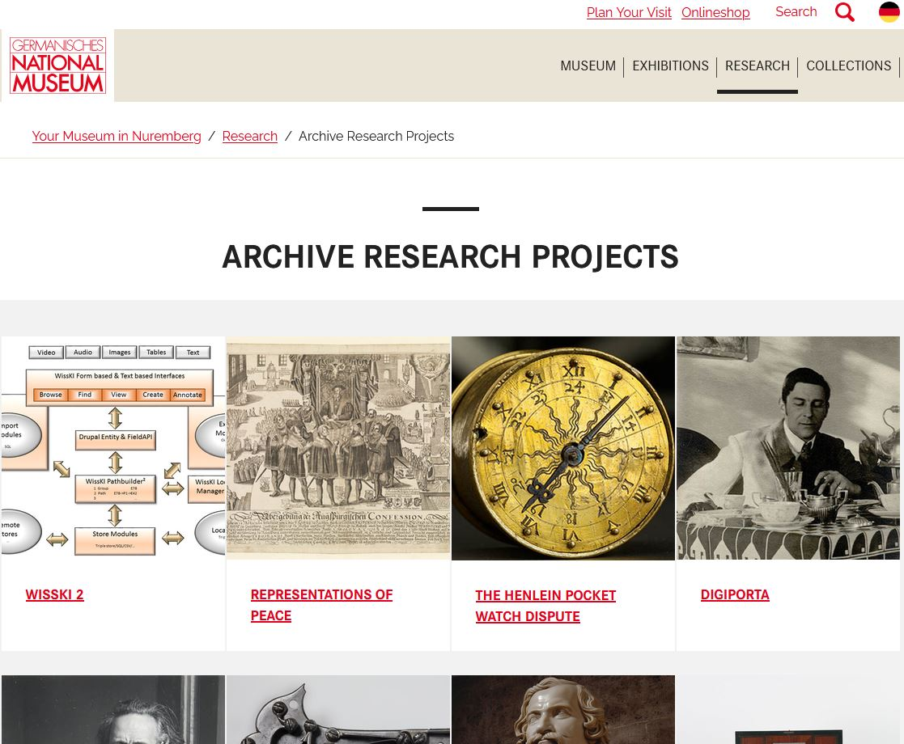
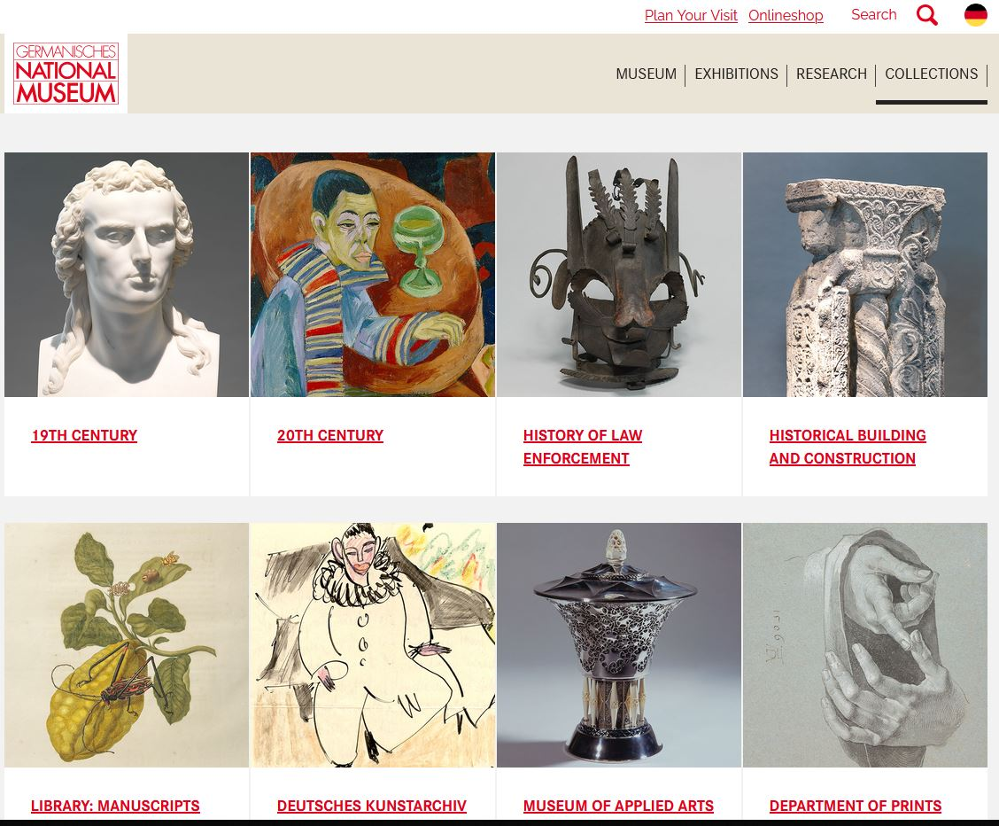
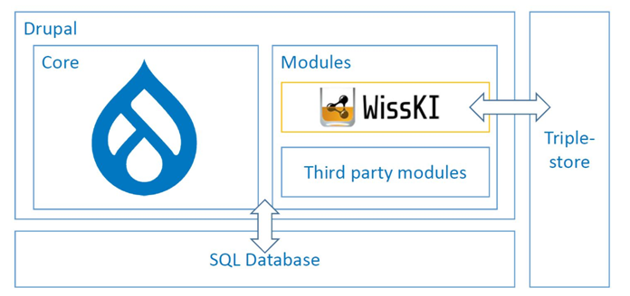

<!--
*titel:
*author:in/urheber:in: 
orcid: 
email: SODa@sammlungen.io
*lizenz: cc by
lizenzlink: https://creativecommons.org/
*persistenter OER link: 
language: 
version:  v1
beschreibung: 
format: SODa WissKI How-to-Tutorial
modultitel: 
modul: Unit 1
einheitstitel: Welcome and warm-up 
eiheit: Einheit 1
lernziel: 

baustein:
zielgruppe: https://zenodo.org/records/15574575
gestaltungsprinzip: 
keywords: ???
erstellungsdatum: 

technische metadaten:
medientyp: text
dateiformat: .md
dauer: 
größe:
software: Web

icon: https://sammlungen.io/themes/custom/brause_theme/brause_theme/logo.svg

link: https://raw.githubusercontent.com/chastik/WissKI/refs/heads/main/soda.css

-->

# SODa WissKI-ISWC25 Bits

DEVELOP AND IMPLEMENT YOUR DATA MODEL

From collection to diagram - understanding and explaining

**Unit 3:  WissKI in a nutshell - Short introduction to WissKI and its architecture**

Duration: ~ 15 Min.

## WissKI in a Nutshell

WissKI...

* stands for "Wissenschaftliche Kommunikations-Infrastruktur" (Scientific Communication Infrastructure) 
* is an open-source, free, web-based virtual research environment for scientific research and cultural heritage data
* based on the Wiki-approach
* is modular and flexible supporting many standards and interfaces.

WissKI is used in the **Germanisches Nationalmuseum**, the largest museum of cultural history in the German-speaking region. Setting nation-wide standards through its scientific and scholarly achievements.

<table>
  <tr>
    <td></td>
    <td></td>
  </tr>
</table>

WissKI is not just a database for exhibitions and collections - it is a semantic data management system and enables researchers to model data semantically als Linked Open Data (LOD) and make it interoperable and FAIR (Findable, Accessible, Interoperable, Reusable).

## WissKI Modules in Drupal 10

WissKI...

* is not a standalone system
* is built as a semantic extension of Drupal 10
* consists of interoperating Drupal modules
* stores data natively in RDF triple stores (SPARQL 1.1)

<table>
  <tr>
    <td></td>
  </tr>
</table>

| **WissKI inherits Drupal core features** | **… and adds semantic capabilities** |
|-----------------------------------------|--------------------------------------|
| * User and role management             | * CIDOC CRM integration             |
| * Multilingual support                 | * OWL-based ontology support        |
| * REST/JSON APIs                       | * Pathbuilder for semantic paths    |
| * Security and access control          | * Semantic entity management        |
| * Modular extensibility                | * Linked Open Data publishing (RDF/SPARQL) |

## The WissKI Pathbuilder

The Pathbuilder is the heart of WissKI and defines the semantic data model.

Instead of designing tables like in a relational database, WissKI uses ontological logic to structure data.

The Pathbuilder defines:

* Groups - semantic entity types (e.g. Object, Person, Place, Event)
* Paths – semantic relationships based on an ontology (e.g. “Object → created by → Person”)
* Widgets/forms – data entry interfaces automatically generated from paths

This enables ontology-based modeling keeping the user interface simple and practical.

## Semantic Data Modeling (the WissKI-Way)

In WissKI, we don’t just store data – we model **meaning**.

In a traditional database you ask: 
> *Which table stores persons and how do I join them to objects?*

In WissKI we ask: 
> *What is the real-world relationship between an object and a person?*

Example semantic expression:

**Object → was produced by → Production Event → carried out by → Person → at → Place**

WissKI connects **conceptual modeling** with **technical implementation** in a transparent way:

| Step | Description |
|------|-------------|
| **Ontology** | Defines the domain knowledge using classes (e.g. *E22 Man-Made Object*) and relationships (e.g. *P108 was produced by*) from CIDOC CRM or other ontologies. This step captures the **semantic meaning** of the data. |
| **Pathbuilder** | Translates the ontology into **semantic paths**. These paths represent meaningful relationships between concepts and form the **data model** inside WissKI. No tables or SQL schemas are needed. |
| **Form generation** | Based on path definitions, WissKI automatically creates **data entry forms** (bundles). These forms follow the semantic logic of the ontology and ensure consistent, structured data input. |
| **Knowledge graph** | The entered data is stored as **RDF triples** and can be queried and published via **SPARQL** or exported as **Linked Open Data** — making the data reusable beyond WissKI. |

### Why this matters

* Semantic relationships are **machine-readable** and reflect real-world meaning.
* Data becomes **interoperable** across institutions and systems.
* Models are aligned with **FAIR Principles** (Findable, Accessible, Interoperable, Reusable).
* Knowledge stays **transparent**, **logical**, and **reusable** beyond one software system.

> **Key principle:** In WissKI, data is structured by **relationships and meaning**, not by tables.

## Summary

WissKI connects **ontologies** with **data modeling**.  
From ontology classes and relationships (e.g. CIDOC CRM), WissKI constructs **semantic paths**. These paths define the **structure of the data model** and are later transformed into **forms for data entry**.

Ontology (concepts & relations)
↓
Semantic paths in WissKI
↓
Forms & data input
↓
RDF knowledge graph output

This means that ontology design functions as the **structural foundation** of WissKI. 

