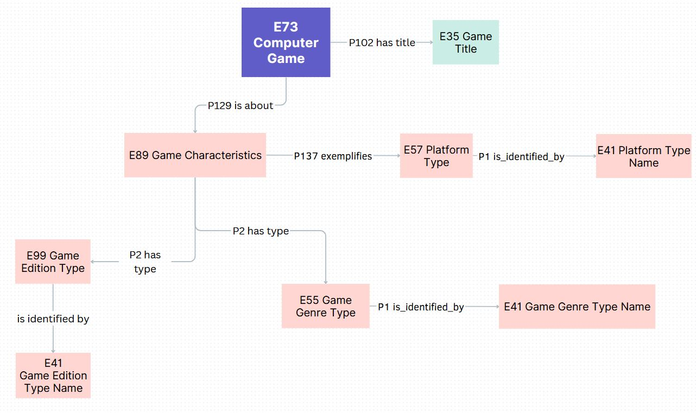

<!--
*titel:
*author:in/urheber:in: 
orcid: 
email: SODa@sammlungen.io
*lizenz: cc by
lizenzlink: https://creativecommons.org/
*persistenter OER link: 
language: 
version:  v1
beschreibung: 
format: SODa WissKI How-to-Tutorial
modultitel: 
modul: Unit 1
einheitstitel: Welcome and warm-up 
eiheit: Einheit 1
lernziel: 

baustein:
zielgruppe: https://zenodo.org/records/15574575
gestaltungsprinzip: 
keywords: ???
erstellungsdatum: 

technische metadaten:
medientyp: text
dateiformat: .md
dauer: 
größe:
software: Web

icon: https://github.com/chastik/Beratung_Dateityp_Bild/refs/heads/main/resources/SODa-Logo_full.svg

link: https://raw.githubusercontent.com/chastik/WissKI/refs/heads/main/soda.css

-->

# SODa WissKI-ISWC25 Bits

DEVELOP AND IMPLEMENT YOUR DATA MODEL

From collection to diagram - understanding and explaining

Unit 5: Identify core entities from a collection - Joint exploration

Duration: ~ 20 Min.

### Goal and Scenario

In this unit, we move from theory to practice. 

Using a small domain example—a sample collection of computer games — we collaboratively explore how to identify and model domain concepts. 

The aim is to extend the MEGA Ontology by introducing concepts relevant for **collection management** and **research**.

Together we will:

* analyze an example domain (computer games)
* identify core entities and meaningful relationships
* distinguish between domain concepts and semantic classes
* map concepts to **CIDOC CRM** classes
* prepare a conceptual data model that we will later formalize in **Protégé** and **WissKI**

### Focus of the Extension

* **Game title**
* **Game characteristics**
  
  * Platform (e.g. Nintendo 64, PlayStation, PC)
  * Genre (e.g. Action-adventure, RPG)
  * Edition or version (e.g. Collector’s Edition, Remastered)
    
* **Game narrative elements**
  
  * Perspective (e.g. first-person, third-person)
  * Game description
  * Game Characters

### Why this domain?

This example domain is well suited for semantic modeling because it contains:

* Physical and digital representations of objects
* Creation and production context (developers, publishers)
* Event structures (release events)
* Versions and editions
* Identifiers and collection metadata

### Group Activity

You will work in teams of 3–4 people to create a **semantic mindmap** of the domain.  
Your task:

* identify **core entity types**
* define how they are **related**
* add **metadata** and **attributes**
* map them to **CIDOC CRM classes**
* indicate **MEGA Ontology extensions**

Use pen and paper or sticky notes during the exercise.

Each group presents:

* the core entity types
* relationships between them
* based on first CIDOC CRM mapping

The results are collected and discussed together.

**Guiding steps**

| Step | Question                              | Goal                            |
| ---- | ------------------------------------- | -------------------------------- |
| 1    | What are the core entities?           | Identify building blocks         |
| 2    | Which relationships connect them?     | Describe relations               |
| 3    | Which properties or attributes exist? | Add metadata                     |
| 4    | How does this map to CIDOC CRM?       | Semantic modeling                |
| 5    | What extends the MEGA Ontology?       | Domain integration               |

## Quick CIDOC CRM Demonstration

Before modeling, we briefly explore how the (CIDOC CRM specification (v7.1.3))[https://cidoc-crm.org/sites/default/files/cidoc_crm_version_7.1.3.pdf] defines basic classes.

This helps us recognize entity types and choose appropriate semantic mappings.

Examples from the CIDOC CRM class hierarchy:

| CIDOC CRM Class             | Meaning                                       |
| --------------------------- | --------------------------------------------- |
| **E28 Conceptual Object**   | Game as intellectual content                  |
| **E84 Information Carrier** | Physical copy of the game                     |
| **E21 Person**              | Composer, designer, individual contributor    |
| **E74 Group**               | Development studio, publisher                 |
| **E12 Production**          | Release event or game publication             |
| **E42 Identifier**          | Product code, inventory number, serial number |

## Group Task

You will work in small groups (3–4 people).

Your task: 

* create a semantic mindmap of the domain
* focussing on game characteristics (platform, genre, edition/version)
* and narrative elements (perspective, description, character).

Each group will write down ideas using pen and paper or sticky notes.

### Group Work Brainstorming

| Step | Question                              | Goal                            |
| ---- | ------------------------------------- | ------------------------------- |
| 1    | What are the core entities?           | Identify domain building blocks |
| 2    | Which relationships connect them?     | Capture relations               |
| 3    | Which properties or attributes exist? | Add metadata                    |
| 4    | How could these map to CIDOC CRM?     | Anchor in ontology              |
| 5    | Which belong to MEGA Ontology?        | Domain extension awareness      |

### CIDOC CRM Mapping (Examples) - Help Table

| Domain Concept      | CIDOC CRM Suggestion    |
| ------------------- | ----------------------- |
| Game (conceptual)   | E28 Conceptual Object   |
| Physical copy       | E84 Information Carrier |
| Developer/Publisher | E21 Person / E74 Group  |
| Release event       | E12 Production          |
| Identifier          | E42 Identifier          |

### Result

<table>
  <tr>
    <td></td>
  </tr>
</table>

**Explanaition of modeling paths**

| Path                                                                                                  | Meaning                                               | Why this modeling?                                                                                                                                                                      |
| ----------------------------------------------------------------------------------------------------- | ----------------------------------------------------- | --------------------------------------------------------------------------------------------------------------------------------------------------------------------------------------- |
| **E73 → P102 has title → E35 Title**                                                                  | The game has a title                                  | The title is modeled as an **entity** (E35) instead of a string so it can have **language, variants, alternative titles, and provenance** (who assigned it).                            |
| **E73 → P129 is about → E89 Propositional Object (Characteristics)**                                  | The game has descriptive characteristics              | E89 allows a **bundle of statements** about the game (genre, platform, edition) that can be traced to **sources and evidence**.                                                         |
| **E73 → P129 → E89 → P137 exemplifies → E57 Type (Platform) → P1 is identified by → E41 Appellation** | The platform (e.g., "Nintendo 64") of the game        | Platforms are **controlled terms**, not free text. Modeling them as **Types (E57)** supports controlled vocabularies and reuse. The actual platform name is stored as an **E41 label**. |
| **E73 → P129 → E89 → P2 has type → E55 Type (Genre) → P1 is identified by → E41 Appellation**         | The genre (e.g., "Action-Adventure") of the game      | Genre is a **classification** and belongs to **E55 Type**. Using E55 enables classification hierarchies, controlled values, and vocabulary alignment.                                   |
| **E73 → P129 → E89 → P2 has type → E99 Type (Edition) → P1 is identified by → E41 Appellation**       | The edition (e.g., "Collector’s Edition") of the game | Editions are **domain-specific subtypes**. Modeling them as **Types (E99)** lets us distinguish different releases semantically.                                                        |

**Why does most path end with E41 Appellation?**

| Concept                 | Explanation                                                                                                                                                                                                                                                                                                |
| ----------------------- | ---------------------------------------------------------------------------------------------------------------------------------------------------------------------------------------------------------------------------------------------------------------------------------------------------------- |
| **E41 Appellation**     | Appears at the end because **names and labels are first-class citizens in CIDOC CRM**, not just strings. Using E41 allows: <ul><li>multilingual labels</li><li>alternative names</li><li>stable identifiers (URIs, codes)</li><li>controlled vocabulary references</li><li>provenance for naming</li></ul> |
| **P1 is identified by** | Connects the entity (e.g. platform, genre type) with its **name or identifier**, making the model readable and interoperable.                                                                                                                                                                              |

