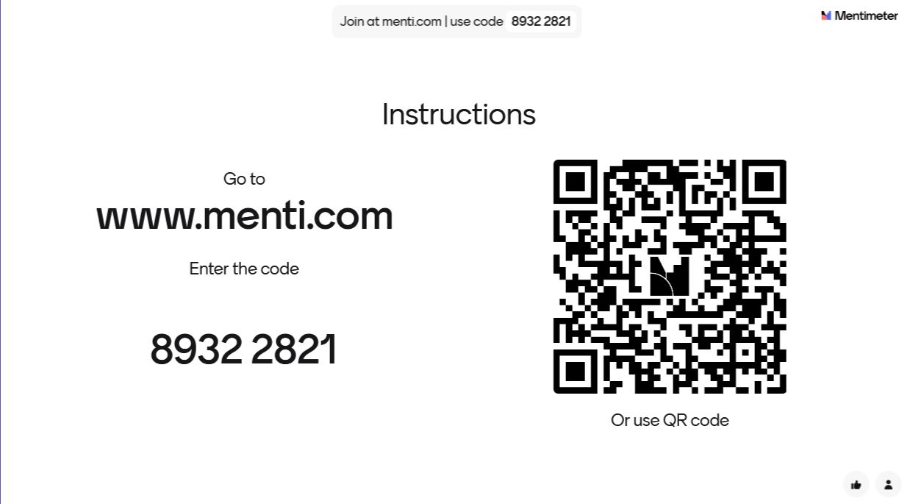

<!--
*titel:
*author:in/urheber:in: 
orcid: 
email: SODa@sammlungen.io
*lizenz: cc by
lizenzlink: https://creativecommons.org/
*persistenter OER link: 
language: 
version:  v1
beschreibung: 
format: SODa WissKI How-to-Tutorial
modultitel: 
modul: Unit 1
einheitstitel: Welcome and warm-up 
eiheit: Einheit 1
lernziel: 

baustein:
zielgruppe: https://zenodo.org/records/15574575
gestaltungsprinzip: 
keywords: ???
erstellungsdatum: 

technische metadaten:
medientyp: text
dateiformat: .md
dauer: 
größe:
software: Web

icon: https://github.com/chastik/Beratung_Dateityp_Bild/refs/heads/main/resources/SODa-Logo_full.svg

link: https://raw.githubusercontent.com/chastik/WissKI/refs/heads/main/soda.css

-->

# SODa WissKI-ISWC25 Bits

DEVELOP AND IMPLEMENT YOUR DATA MODEL  

From collection to diagram – understanding and explaining  

Unit 7: Reflection & Conceptual Consolidation  

Duration: ~ 15 Min.

---

## Your Feeback is Valuable

<table>
  <tr>
    <td></td>
  </tr>
</table>

## Goal of this Unit

This session reflects on the **modeling process so far**, let us discuss...

* What worked well ?
* What was challenging ?
* Where uncertainties remain ?
* Wnd how confident you feel moving forward into WissKI implementation ?

### Discussion Questions

* How does the workflow (Domain → CRM Mapping → Ontology → Protégé) feel?
  
  - comprehensible
  - manageable with practice
  - overly complex
  - still unclear
    
### Application Scenarios – Open Reflection

* Where can you apply this modeling approach in your institution?
* Do you see realistic use cases in:
  
  * research documentation
  * collection management
  * digital editions
  * knowledge graphs / LOD
  * provenance tracking
    
* Do you see OWL as a technical language only – or as a practical modeling tool?
* Do you consider Linked Open Data (LOD) a relevant scenario for your work?
* Do you feel capable of developing your own domain ontology after today?

