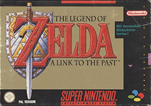

<!--

icon: https://raw.githubusercontent.com/chastik/Beratung_Dateityp_Bild/refs/heads/main/SODa-Logo_full.svg
link: https://raw.githubusercontent.com/chastik/Beratung/refs/heads/main/soda.css

-->

# SODa WissKI-ISWC25 Bits

**DEVELOP AND IMPLEMENT YOUR DATA MODEL**

From collection to diagram - understanding and explaining

**Unit 2: Orientation - Overview of the workflow from data analysis to semantic modeling**

Duration: ~ 5 Min.

---

## From Data to Semantic Modeling

Before we start, let’s briefly frame today’s topic:

* In the humanities, GLAM institutions, and research collections, we work with **complex object data** that carries historical, contextual, and relational meaning (e.g. provenance, associations, interpretations).
* **Spreadsheets can capture attributes**, but they cannot express **relationships, context, or knowledge structures**.
* This is where **semantic data modeling** becomes essential: it allows us to represent knowledge in a **structured and interoperable way**.
* Semantic modeling is **not only a technical task** — it is a **conceptual process** that requires domain knowledge and methodological thinking.
* Today, we will explore how to **translate domain expertise into ontology-based data models** step by step.
* **WissKI** supports this process by linking **ontologies, modeling, and data entry** through its **semantic pathbuilder**.

Our goal today: **connect knowledge organization with practical implementation**.

---

## Workflow Overview

This is workflow will guide us through the tutorial today:

1. Analyzing object data – Understand data entities and relationships
2. Capturing meaning – Identify concepts and properties to build assumptions about the object
3. Modeling semantics – Map meaning to ontology (CIDOC CRM)
4. Creating data paths – Build WissKI semantic paths and build a Pathbuilder
6. Evaluate & discuss – Reflect on the workflows and learning outcomes

---

## Example Object

**Super Nintendo Entertainment System (SNS) Game: Zelda**

| Example |
|---------|
| **Object**    |
| **Semantic Assumption** Title of the object: *The Legend of Zelda: A Link to the Past*   |
| **Draw.io Diagram**    |
| **WissKI Pathbuilder**    |

