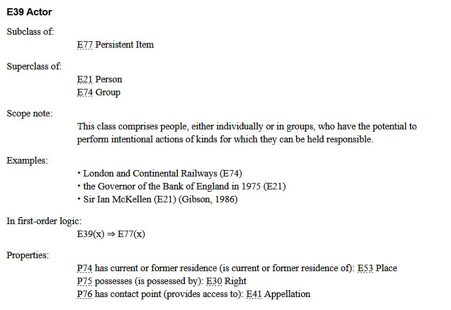

<!--
*titel:
*author:in/urheber:in: 
orcid: 
email: SODa@sammlungen.io
*lizenz: cc by
lizenzlink: https://creativecommons.org/
*persistenter OER link: 
language: 
version:  v1
beschreibung: 
format: SODa WissKI How-to-Tutorial
modultitel: 
modul: Unit 1
einheitstitel: Welcome and warm-up 
eiheit: Einheit 1
lernziel: 

baustein:
zielgruppe: https://zenodo.org/records/15574575
gestaltungsprinzip: 
keywords: ???
erstellungsdatum: 

technische metadaten:
medientyp: text
dateiformat: .md
dauer: 
größe:
software: Web

icon: https://github.com/chastik/Beratung_Dateityp_Bild/refs/heads/main/resources/SODa-Logo_full.svg

link: https://raw.githubusercontent.com/chastik/WissKI/refs/heads/main/soda.css

-->

# SODa WissKI-ISWC25 Bits

**DEVELOP AND IMPLEMENT YOUR DATA MODEL**

From collection to diagram - understanding and explaining

**Unit 4: CIDOC CRM and Domain Ontologies  - Why CIDOC CRM as underlying ontology?**

Duration: ~ 15 Min.

## Why do we use Ontologies?

When we model research data, especially in the cultural heritage and humanities domain, we are not only describing data.

Ontologies help us:

* Express semantic relationships
* Make knowledge machine-readable
* Ensure interoperability across institutions and systems
* Connect our data with Linked Open Data
* Preserve context and provenance.

---

## What is CIDOC CRM?

[CIDOC CRM](https://cidoc-crm.org/) is an [ISO standard ontology (ISO 21127)](https://en.wikipedia.org/wiki/International_standard) developed by CIDOC, the International Committee for Documentation of the [International Concil of Museums (ICOM)](https://icom.museum/en).

It was designed specifically for cultural heritage documentation in GLAM and focuses on events, persons, objects, places, time, and spaces as well as their semantic relations. 

"The CIDOC Conceptual Reference Model (CRM) is a **theoretical and practical tool** for information integration in the field of cultural heritage. It can help researchers, administrators and the public explore complex questions with regards to our past across diverse and dispersed datasets. The CIDOC CRM achieves this by **providing definitions and a formal structure for describing the implicit and explicit concepts and relationships used in cultural heritage documentation and of general interest for the querying and exploration of such data**. CIDOC CRM is a **formal ontology**. These formal descriptions allow the integration of data from multiple sources in a software and schema agnostic fashion.

The CIDOC CRM has been developed in a manner that is intended to **promote a shared understanding of cultural heritage information** by providing a common and extensible semantic framework for evidence-based cultural heritage information integration. It is intended to be **a common language for domain experts** and implementers to formulate requirements for information systems and to serve as **a guide for good practice of conceptual modelling**. In this way, it can provide the **"semantic glue" needed to mediate between different sources** of cultural heritage information, such as that published by museums, libraries and archives." [https://cidoc-crm.org/]

**WissKI is based on CIDOC CRM OWL ontology but can also use others!**

---

## Key Concepts in CIDOC CRM

CIDOC CRM is event-centric:

Instead of stating static facts, it models what happened to an object and its context.

| Concept Dimension | Example Class                 | Description                   |
| ----------------- | ----------------------------- | ----------------------------- |
| Thing             | **E70 Thing**                 | Physical or conceptual entity |
| Physical Object   | **E22 Human-Made Object**       | Artefact, specimen, artwork   |
| Actor             | **E21 Person**, **E74 Group** | People or organizations       |
| Event             | **E5 Event**                  | Something that happens        |
| Place             | **E53 Place**                 | Spatial entity                |
| Time              | **E52 Time-Span**             | Temporal extent               |

---

## CIDOC CRM Class Hierarchy and Scope Notes

The suitability of a CIDOC CRM class for modeling a concept is determined by its **scope note**,
not by:

* its name
* its position in the ontology hierarchy
* assumed intuitive meaning.

The scope note defines the intended semantics and conceptual boundaries of a class and must always guide its correct use.
<table>
  <tr>
    <td></td>
  </tr>
</table>

*Note:* There are different valid approaches to building domain ontologies. Some models introduce both subclasses **and** new properties, others define only **semantic paths using existing CIDOC CRM classes and properties without extending the class hierarchy**, and some combine **subclassing with property reuse**.  
In this tutorial, we follow a **lightweight extension strategy**: we define **domain-specific subclasses** where necessary, while **reusing existing CIDOC CRM properties as much as possible** to remain interoperable and CIDOC-compliant.

---

## Expressing Meaning with CIDOC CRM

**Example**

*A video game titled "The Legend of Zelda: A Link to the Past" was created by Nintendo in Japan in 1991.*

**Natural Language Assumptions**

* The item is a thing.
* The boxed SNES Zelda game is a physical object.
* It was created in a production event.
* The production was carried out by Nintendo.
* The production took place in Kyoto, Japan.
* It happened in 1991.
* Its title is *The Legend of Zelda: A Link to the Past*.

**CIDOC CRM Classes with ZELDA data** 

* E22 Object (SNS Game) → has title → E35 Title (The Legend of Zelda: A Link to the Past)
* E22 Object → was created by → E65 Creation → carried out by → E74 Group (Nintendo)
* E22 Object → was produced at → E53 Place (Kyoto, Japan)
* E22 Object → was created in → E52 Time-Span (1991)

---

### Example Vase 

*A vase was found during an excavation by a research team in Nara in 2005.*

| Natural Language Description                  | CIDOC CRM Representation                         |
|-----------------------------------------------|--------------------------------------------------|
| The vase is an object                         | E22 Human-Made Object                              |
| It was found in an excavation                 | P12 occurred in → E5 Event                       |
| The excavation was carried out by a team      | P14 carried out by → E74 Group                   |
| The event took place in Nara                  | P7 took place at → E53 Place                     |
| The event happened in 2005                    | P4 has time-span → E52 Time-Span                 |

---

## Top Level Ontologys vs. Domain Ontologys 

A top level ontology is used to model the general structure of knowledge while a domain ontology expresses disciplinary details and specifications. Instead of flat, record-centric metadata, CIDOC CRM geneates context-rich knowledge.

**Top Level (Core) Ontology**

* Provides a general, shared semantic backbone, e.g. CIDOC CRM
* Defines fundamental categories such as Thing, Event, Actor, Place, Time
* Ensures interoperability and consistency across systems

**Domain Ontologies**

* Extend the core ontology with domain-specific concepts
* Add precision without breaking compatibility
* Used for controlles vocabulary or authority data 

This two-level approach gives us:

* Semantic clarity
* Interoperability
* Extensibility
* Long-term sustainability 

---

## This is why WissKI uses CIDOC CRM

CIDOC CRM...

* provides precise, machine-readable semantics that eliminate ambiguity
* guarantees semantic interoperability between institutions and disciplines
* offers a robust ontological framework fully aligned with the WissKI Pathbuilder
* supports event-based modeling to retain historical context and provenance
* complies with FAIR principles (Findable, Accessible, Interoperable, Reusable)
* connects naturally to the Linked Open Data ecosystem
* enables the creation of sustainable, standards-based knowledge graphs 

---

## Final note

WissKI brings intelligent semantics to your data, by...

* CIDOC CRM ontology – defining a formal framework of domain concepts and their relationships for cultural heritage data
* Semantic paths – modeling logical data structures and meanings within the Pathbuilder environment
* Forms and data entry – ensuring consistent, schema-based, and standardized knowledge capture
* RDF knowledge graph – providing a standards-compliant foundation for interoperability, reuse, and Linked Open Data publication

