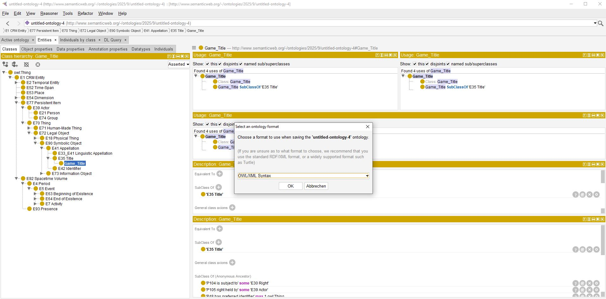

<!--
*titel:
*author:in/urheber:in: 
orcid: 
email: SODa@sammlungen.io
*lizenz: cc by
lizenzlink: https://creativecommons.org/
*persistenter OER link: 
language: 
version:  v1
beschreibung: 
format: SODa WissKI How-to-Tutorial
modultitel: 
modul: Unit 1
einheitstitel: Welcome and warm-up 
eiheit: Einheit 1
lernziel: 

baustein:
zielgruppe: https://zenodo.org/records/15574575
gestaltungsprinzip: 
keywords: ???
erstellungsdatum: 

technische metadaten:
medientyp: text
dateiformat: .md
dauer: 
größe:
software: Web

icon: https://github.com/chastik/Beratung_Dateityp_Bild/refs/heads/main/resources/SODa-Logo_full.svg

link: https://raw.githubusercontent.com/chastik/WissKI/refs/heads/main/soda.css

-->

# SODa WissKI-ISWC25 Bits

**DEVELOP AND IMPLEMENT YOUR DATA MODEL**

From collection to diagram - understanding and explaining

Unit 6: Modular Extension of Domain-Specific Subclasses in the Erlangen CRM (OWL)

Duration: ~ 10 Min.

---

##  Live Demo in Protegé

This session demonstrate how to develop a domain ontology based on CIDOC CRM using Protégé.

Protégé is a freely available ontology editor that can be downloaded online here: https://protege.stanford.edu. 

After installation, it presents a simple yet initially somewhat unfamiliar interface. Nevertheless, it is entirely feasible to construct and extend a domain ontology — even without extensive prior experience — by following a clear methodology.

---

### Overview of Steps

* Load an existing ontology (e.g. [Erlangen CRM](https://erlangen-crm.org)) *Note: Erlangen CRM is an OWL implementation of CIDOC CRM: [Direct Download](https://erlangen-crm.org/ontology/ecrm/ecrm_240307.owl)*
* Explore ontology structure (classes, object properties, data properties)
* Create **subclasses** for new domain concepts (e.g. Game_Characteristic, Platform_Type, Genre_Type, Edition_Type)
* Save and export the ontology 

!?[autoplay video](../assets/Short_Protege_Intro.mp4)

<table>
  <tr>
    <td></td>
  </tr>
</table>

