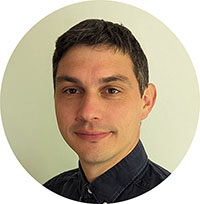
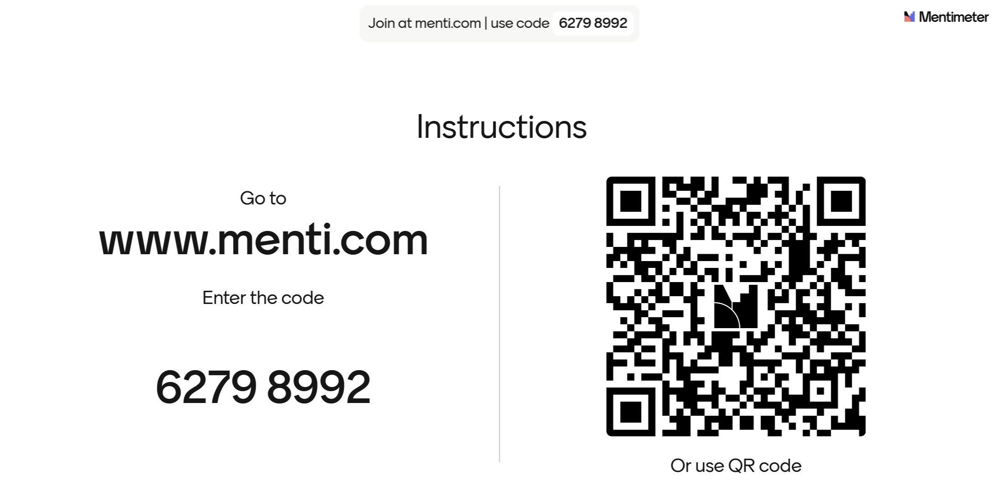

<!--

icon: https://raw.githubusercontent.com/chastik/Beratung_Dateityp_Bild/refs/heads/main/SODa-Logo_full.svg
link: https://raw.githubusercontent.com/chastik/Beratung/refs/heads/main/soda.css

-->

# SODa WissKI-ISWC25 Bits

**DEVELOP AND IMPLEMENT YOUR DATA MODEL** 

From collection to diagram to paths - understanding and creating (anpassen in session 2) 

**Unit 1: Welcome and Warm-up**

Duration: ~ 20 Min.

> Good morning, and welcome to the tutorial **SODa WissKI Bits: Ontology-driven Research Data Modeling** here at International Semantic Web Conference (ISWC) 2025 in Nara. 
>
> My name is **Canan**, and I will guide you through this hands-on exploration of WissKI, an ontology-based virtual research environment for GLAM (Gallery, Library, Archive, and Museum) institutions and their collections.
>
> This tutorial follows a **learning-by-doing approach**.
> That means we will not only discuss ontology-based data modeling – we will work with real data examples and model step by step together.

---

## Session Outline 

** Session 1: 9:00 am - 10:30 am**

* Unit 1 Welcome and warm-up (15 Min.)

Introduction to the tutorial objectives and schedule and short participant interaction.

* Unit 2 Orientation (5 Min.)

Overview of the workflow from data analysis to semantic modeling.

* Unit 3 WissKI in a nutshell (10 Min.)

Short introduction to WissKI, its architecture, and CIDOC CRM as underlying ontology.

* Unit 4 CIDOC CRM and Domain Ontologies (15 Min.)

Why CIDOC CRM as an underlying ontology?

* Unit 5 Identify core entities from a collection (20 Min.)

Joint exploration of a sample collection using the MEGA domain ontology.

* Unit 6 Live-Demo in Protegé (10 Min.)

Integration of a Modular Extension into an Existing Knowledge Model

* Unit 7 Group discussion and feedback (5 Min.)

Participants provide feedback on the workflow and reflect on the relevance and clarity of the conceptual modeling process.

---

## About the SODa Project

My colleagues and I are members of the [SODa project team](https://sammlungen.io/projekt).

**SODa project** promotes sustainable infrastructures for research data and scientific collections. 

Its goal is to strengthen data literacy and data science expertise in collection-based research.

Across Germany, more than 1,200 scientific collections preserve and provide access to valuable research materials — spanning fields such as zoology, mineralogy, botany, archaeology, game studies, and many others.

These collections form a vital foundation for:

* research-driven knowledge creation,
* disciplinary development,
* and academic teaching.

To remain sustainable and usable over the long term, these collections depend on structured, interoperable data management.

This is precisely where **WissKI and ontology-based data modeling** can make a difference, providing powerful tools to support real-world research workflows.

The target group primarily comprises collection managers and staff members who possess limited expertise in the fields of digital literacy and research data management, as only a small proportion of collections have been digitized to date.

---

## About the Team

Together with my colleagues **Gudrun** and **Mark**, we designed this tutorial.

<table>
  <tr>
    <td></td>
    <td></td>
     </tr>
</table>

We were supported by **Elias**. 

 <table>
  <tr>
    <td></td>
  </tr>
</table>

Elias developed a pipeline that converts conceptual semantic diagrams from draw.io into semantic paths as XML files for WissKI Pathbuilder.

This allows us to generate application profiles automatically and keep the underlying ontology consistent.

---

## Objectives

By the end of this tutorial...

| You will be able to...                                   | Learning Outcome                                                                                                                                                 |
|----------------------------------------------------------|------------------------------------------------------------------------------------------------------------------------------------------------------------------|
| **Understand ontology-based data modeling with WissKI**  | • use ontologies to describe resources (LZ-ID 03\_007\_0780) • evaluate the suitability of different database systems (LZ-ID 02\_010\_0407)                  |
| **Analyze and structure domain collections**             | • analyze an existing WissKI collection • apply a data curation concept considering semantic modeling and FAIR (LZ-ID 02\_016\_0567)                         |
| **Build semantic paths and simple knowledge graphs**     | • use WissKI Pathbuilder to model groups and paths (LZ-ID 03\_dataModeling\_soda0001) • verify groups and paths (LZ-ID 03\_dataModeling\_soda0006)          |
| **Reflect on semantic modeling practices and challenges**| • independently analyze metadata standards (LZ-ID 03\_003\_0657) • identify quality criteria for controlled vocabularies (LZ-ID 03\_005\_0717)              |

---

## Before we start...

I’d like to learn a bit about your expectations and experience.

* What do you hope to gain from this tutorial?
* What brings you to ISWC 2025, and what are you currently working on?
* What is your experience with semantic modeling?
* What challenges have you encountered so far?

To tailor this session to your needs, please take part in a short interactive Mentimeter poll.

**How to**

* Open Mentimeter via the link and enter the code **or** scan the QR code to join.
* I will open the questions one by one — please answer step by step.
* We will move on only after everyone has responded.
* The survey is anonymous and no personal data is collected.

**Thank you for participating!**

 <table>
    <tr>
      <td></td>
    </tr>
</table>

---

## Speed Dating Warm-Up

To get the energy flowing and build connections, we’ll start with a quick speed networking round — a chance to connect across cultures and backgrounds.

**How it works**

* Find someone nearby — ideally someone you haven’t talked to yet.  
* Interview each other using the three questions below.  
* Each person has 30 seconds to answer.  
* After each round, switch partners.  
* Then repeat with someone new.

**Questions to ask each other**

* What’s your name and where are you from?
* Which languages do you speak?
* What's one fun fact about yourself — academic or random?

**Fun fact examples – anything goes!**

* You once tried to model your kitchen in the Web Ontology Language (OWL).
* Your pet is named *SPARQL* (query language for Linked Open Data).
* You collect Japanese whisky (Yamazaki, Hakushu, Hibiki), capsule toys, Pokémon cards…

**Ready? Let’s go!**
