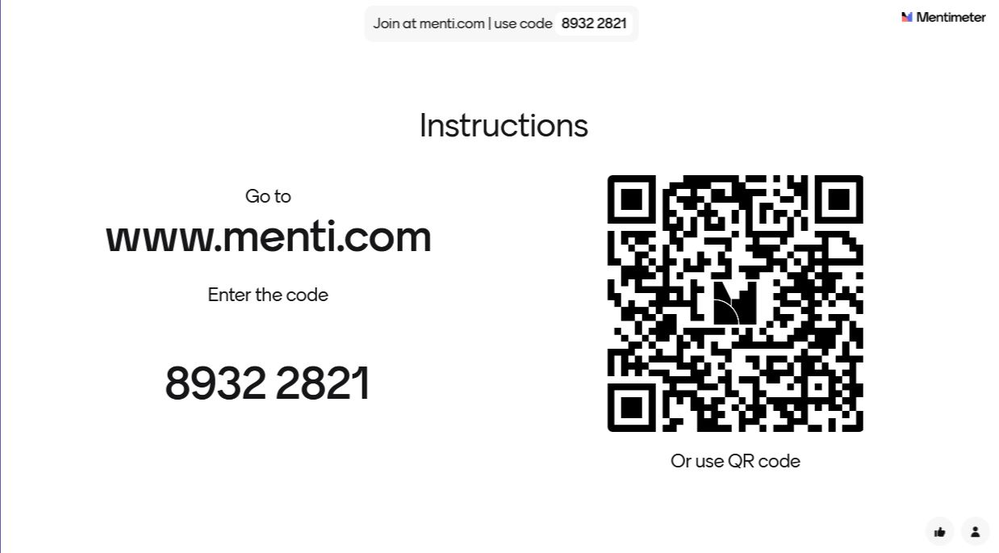

<!--

icon: https://raw.githubusercontent.com/chastik/Beratung_Dateityp_Bild/refs/heads/main/SODa-Logo_full.svg
link: https://raw.githubusercontent.com/chastik/Beratung/refs/heads/main/soda.css

-->

# SODa WissKI-ISWC25 Bits

**DEVELOP AND IMPLEMENT YOUR DATA MODEL**

From collection to diagram – understanding and explaining  

Unit 7: Reflection & Conceptual Consolidation  

Duration: ~ 15 Min.

---

## Your Feeback is Valuable

<table>
  <tr>
    <td></td>
  </tr>
</table>

## Goal of this Unit

This session reflects on the **modeling process so far**, let us discuss...

* What worked well ?
* What was challenging ?
* Where uncertainties remain ?
* Wnd how confident you feel moving forward into WissKI implementation ?

