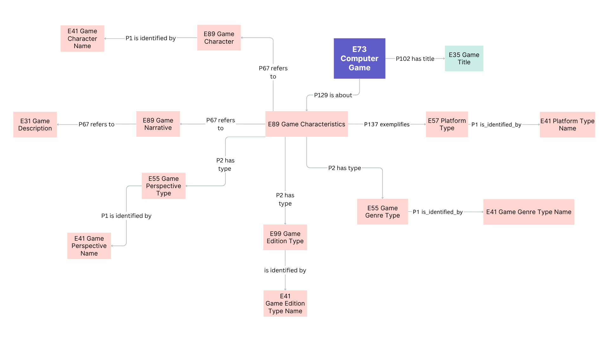

<!--

icon: https://raw.githubusercontent.com/chastik/Beratung_Dateityp_Bild/refs/heads/main/SODa-Logo_full.svg
link: https://raw.githubusercontent.com/chastik/Beratung/refs/heads/main/soda.css

-->

# SODa WissKI-ISWC25 Bits 

**EIGENES DATENMODELL ENTWICKELN UND IMPLEMENTIEREN**  

Vom Diagramm zu Pfaden – Erläutern und anwenden

Einheit 1: **Visualisierung eines Domänenontologie-Diagramms**  

**Dauer:** ~ 20 Min.

---

## Warum in draw.io arbeiten?

Visualisierungen sind nicht nur ein bedeutender Zwischenschritt, sondern auch ein wesentliches Werkzeug, um Modellierungsentscheidungen zu kommunizieren, auszuhandeln und ein gemeinsames Verständnis über semantische Strukturen zu schaffen.

Draw.io hilft uns dabei …

* Entitätsklassen und ihre Beziehungen festzulegen.
* kollaborativ und transparent gemeinsam zu modellieren.
* die Domänenontologie sichtbar zu machen und zu diskutieren.
* die Ontologiestruktur vor der Implementierung zu testen.  

---

## Ausgangspunkt

In Modul 1 haben wurde die konzeptionelle Grundlage unseres Datenmodells entwickelt:

* In **Einheit 5** sind *zentralen Entitäten und Beziehungen* einer Beispiel-Domäne identifiziert.  
* In **Einheit 6** wurde die Top-Level Ontologie CIDOC CRM um *domänenspezifische Subklassen* erweitert.  

### Datenbeispiel

**Beispielobjekt**

Super Nintendo Entertainment System (SNES) Spiel: *The Legend of Zelda*

| Darstellung | Beschreibung |
|------------|--------------|
| **Objekt** |  |
| **Semantische Annahme** | Titel des Objekts: *The Legend of Zelda: A Link to the Past* |
| **Draw.io Modell** |  |
| **WissKI Pathbuilder** |  |

**Beispiele für Spielmerkmale**

* Plattform (z. B. Nintendo 64, PlayStation, PC)
* Genre (z. B. Action-Adventure, RPG)
* Edition oder Version (z. B. Collector’s Edition, Remastered)

**Beispiele für narrative Elemente**

* Perspektive (z. B. First-Person, Third-Person)
* Spielbeschreibung
* Charaktere / Figuren
---

## Was wir modellieren

Jetzt visualisieren wir dieses semantische Modell in draw.io als Vorbereitung für die WissKI-Implementierung.  
Wir beginnen damit, die Kernentitäten und ihre Beziehungen semantisch korrekt auf Basis des CIDOC CRM zu modellieren:

**Beispielergebnisse**

<table>
  <tr>
    <td></td>
  </tr>
</table>

---

## Modellierungsanforderungen

* Verwende Ontologieklassen statt individueller Instanzen.  
* Richte dich nach den CIDOC CRM-Mappings für konzeptuelle Konsistenz.  
* Verwende semantische Properties (Verben) aus dem CIDOC CRM, um Beziehungen zu definieren.  
* Nutze domänenspezifische Subklassen, wo immer dies möglich ist.  
* Achte darauf, dass das Modell sauber, konsistent und gut lesbar bleibt.  
* Weise dem Startknoten, jedem Gruppenknoten und jedem Blattknoten jeweils **element_id**, **group_name** und **name** zu.  

---

## Aufgabe (Partnerarbeit – 15 Min.)

* Öffnet die vorbereitete draw.io-Vorlage  
* Modelliert die Entitäten eurer Domäne  
* Verwendet für semantische Beziehun*

