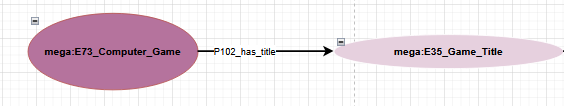
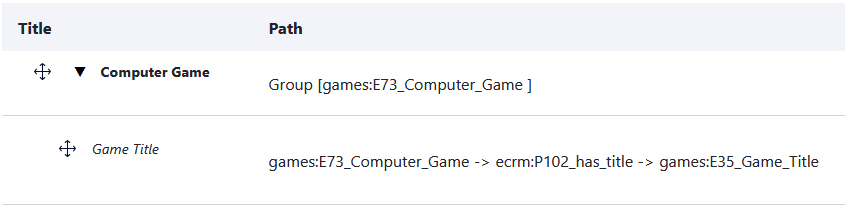

<!--

icon: https://raw.githubusercontent.com/chastik/Beratung_Dateityp_Bild/refs/heads/main/SODa-Logo_full.svg
link: https://raw.githubusercontent.com/chastik/Beratung/refs/heads/main/soda.css

-->

# SODa WissKI-ISWC25 Bits 

**EIGENES DATENMODELL ENTWICKELN UND IMPLEMENTIEREN**  

Vom Diagramm zu Pfaden – Erläutern und anwenden

Einheit 1: **Visualisierung eines Domänenontologie-Diagramms**  

**Dauer:** ~ 20 Min.

---

## Warum in Draw.io arbeiten?

Visualisierungen sind nicht nur ein bedeutender Zwischenschritt, sondern auch ein wesentliches Werkzeug, um Modellierungsentscheidungen zu kommunizieren, auszuhandeln und ein gemeinsames Verständnis über semantische Strukturen zu schaffen.

Draw.io hilft uns dabei …

* Entitätsklassen und ihre Beziehungen festzulegen.
* kollaborativ und transparent gemeinsam zu modellieren.
* die Domänenontologie und die Logik sichtbar zu machen und zu diskutieren.
* die Ontologiestruktur vor der Implementierung zu testen.  

---

## Ausgangspunkt

In Modul 1 haben wurde die konzeptionelle Grundlage unseres Datenmodells entwickelt:

* In **Einheit 5** sind *zentralen Entitäten und Beziehungen* einer Beispiel-Domäne identifiziert.  
* In **Einheit 6** wurde die Top-Level Ontologie CIDOC CRM um *domänenspezifische Subklassen* erweitert.  

### Datenbeispiel

**Beispielobjekt**

Super Nintendo Entertainment System (SNES) Spiel: *The Legend of Zelda*

| Darstellung | Beschreibung |
|------------|--------------|
| **Objekt** |  |
| **Semantische Annahme** | Titel des Objekts: *The Legend of Zelda: A Link to the Past* |
| **Draw.io Modell** |  |
| **WissKI Pathbuilder** |  |

**Beispiele für Spielmerkmale**

* Plattform (z. B. Nintendo 64, PlayStation, PC)
* Genre (z. B. Action-Adventure, RPG)
* Edition oder Version (z. B. Collector’s Edition, Remastered)

**Beispiele für narrative Elemente**

* Perspektive (z. B. First-Person, Third-Person)
* Spielbeschreibung
* Charaktere / Figuren
---

## Was wir modellieren

Modelliert wird das semantische Modell in Draw.io als Grundlage für die Erstellung von Pfaden in WissKI.  
Hierfür werden die Kernentitäten und ihre Beziehungen der Beispieldomäne semantisch korrekt auf Basis des CIDOC CRM visualisiert:

**Beispielergebnisse**

<table>
  <tr>
    <td></td>
  </tr>
</table>

---

## Anforderungen an das Arbeiten mit Draw.io

* Es werden keine individuelle Instanzen abgebildet.
* Es werden die domänenspezifischen Sub-Klassen aus der bereits erstellten Domänenontologie verwendet.
* Die semantischen Relationen sind aus CIDOC CRM abzuleiten.
* Es sind vollständige Pfade zu erstellen.
* Weise dem Startknoten, jedem Gruppenknoten und jedem Blattknoten jeweils **element_id**, **group_name** und **name** zu.  

---

## Aufgabe (Partnerarbeit – 15 Min.)

* Öffnet die vorbereitete Draw.io-Vorlage (siehe Gruppen)
* Vervollständigt das Diagramm   
* Nutzt für semantische Beziehungen die CIDOC CRM-Properties aus der [CIDOC CRM-Spezifikation (v7.1.3)](https://cidoc-crm.org/sites/default/files/cidoc_crm_version_7.1.3.pdf).
* Nutzt für die Domänenspezifischen Subklassen den bestehenden [.rdf-Entwurf](http://games.m-e-g-a.org/game_domain.rdf).

* Gruppe 15
* Gruppe 14
* Gruppe 13
* Gruppe 12
* Gruppe 11
* Gruppe_10: https://drive.google.com/file/d/1BR38UBlpKeWqab-fOLwndg9bxpsdu1dw/view?usp=sharing or http://tiny.cc/ISWC_10
* Gruppe_09: https://drive.google.com/file/d/1T0imdwR-JdaVnhVTWdXJBu6h4cSU_sFk/view?usp=sharing or http://tiny.cc/ISWC_09
* Gruppe_08: https://drive.google.com/file/d/1zfjCSq_Hfj75lZO5JR3XWeaxOJGT9flC/view?usp=sharing or http://tiny.cc/ISWC_08
* Gruppe_07: https://drive.google.com/file/d/1-rjsKytyPnW_nUbbQ58wHDb5nKt1jxaW/view?usp=sharing or http://tiny.cc/ISWC_07
* Gruppe_06: https://drive.google.com/file/d/1uSzcQUFZFV8Jjwb_vRrqs-FrnPxGBkyw/view?usp=sharing or http://tiny.cc/ISWC_06
* Gruppe_05: https://drive.google.com/file/d/1BUtP_DyM-LHIkSODZwems03UjL8F8mjg/view?usp=sharing or http://tiny.cc/ISWC_05
* Gruppe_04: https://drive.google.com/file/d/1aSlvH9FWKLg3vZdn6vI43HEbVQsXd_q0/view?usp=sharing or http://tiny.cc/ISWC_04
* Gruppe_03: https://drive.google.com/file/d/1WhBd9XGw7KTJOzGN2nMmdvzck4kGSspL/view?usp=sharing or http://tiny.cc/ISWC_03
* Gruppe_02: https://drive.google.com/file/d/1KsEdukcXCTc8O8JKRM4HGoB2bhxVRtfQ/view?usp=sharing or http://tiny.cc/ISWC_02
* Gruppe_01: https://drive.google.com/file/d/1tTFWWsfsFR2QFhhmMG8QgteKfSt0JIgj/view?usp=sharing or http://tiny.cc/ISWC_01

---

### Ressourcen

* **PDF-Datei:** [https://cidoc-crm.org/sites/default/files/cidoc_crm_version_7.1.3.pdf](https://cidoc-crm.org/sites/default/files/cidoc_crm_version_7.1.3.pdf)  
* **HTML-Link:** [https://cidoc-crm.org/html/cidoc_crm_v7.1.3.html](https://cidoc-crm.org/html/cidoc_crm_v7.1.3.html)  
* **Domänenontologie:** [http://games.m-e-g-a.org/game_domain.rdf](http://games.m-e-g-a.org/game_domain.rdf)

---

Dieser Modellierungsschritt ist nicht nur eine visuelle Übung – das Diagramm ist Teil einer (halb-)automatisierten Pipeline (Web-Service) …

Sobald unsere Domänendiagramme fertig sind, werden wir sie im nächsten Schritt in **WissKI Paths** überführen.

