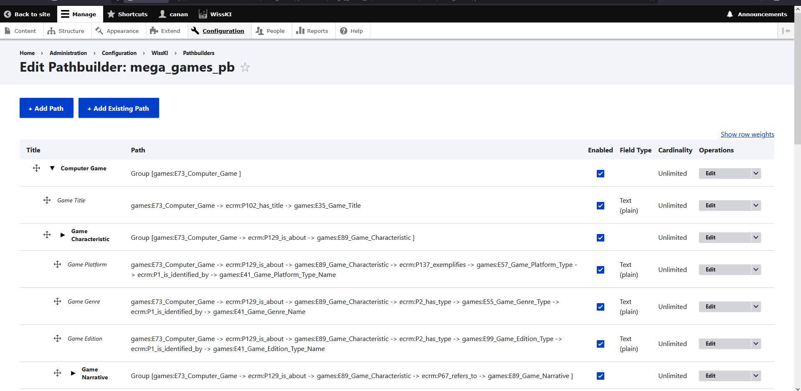

<!--

icon: https://raw.githubusercontent.com/chastik/Beratung_Dateityp_Bild/refs/heads/main/SODa-Logo_full.svg
link: https://raw.githubusercontent.com/chastik/Beratung/refs/heads/main/soda.css

-->

# SODa WissKI-ISWC25 Bits

**EIGENES DATENMODELL ENTWICKELN UND IMPLEMENTIEREN**  

Vom Diagramm zu Pfaden – Erläutern und anwenden

Einheit 3: WissKI Pathbuilder-Datei erzeugen

Duration: ~ 20 Min.

---

## Voraussetzung 

In Modul 1 kann die Basis von CIDOC CRM und Domänenontologien und semantische Beziehungsmodelle für draw.io entwickelt werdemn.  

Da WissKI Ontologiedateien nicht direkt interpretieren kann, benötigt es **semantische Pfade**, um:

* Dateneingabeformulare zu strukturieren und zu organisieren,  
* den RDF-Wissensgraphen aufzubauen und  
* eine ontologiekonforme Datenspeicherung zu gewährleisten.  

Dieser Prozess überbrückt die Lücke zwischen der Ontologiemodellierung und der internen Datenstruktur von WissKI, indem das semantische draw.io-Modell über eine Transformationspipeline automatisch in WissKI-Pfade umgewandelt wird.

---

## Von Ontologiebeziehungen zu WissKI-Pfaden

Die Ontologiemodellierung konzentriert sich auf die Beschreibung von **Klassen** und **semantischen Beziehungen**.  

WissKI implementiert diese Verbindungen als **Pfade** – also Sequenzen von Ontologie-Properties.

Jede semantische Kette wird im WissKI Pathbuilder zu **einem Pfad**.

---

### Beispiel

**Ontologiebeziehung**

Computer Game → wurde erstellt in → Creation Event → durchgeführt von → Group

**WissKI-Gruppe und Pfade**

Computer Game (Group)

* → **P94 wurde erstellt durch** → Creation Event  (Pfad)  
* → **P14 durchgeführt von** → Group  (Pfad)

**Hinweis:** Wenn du **E12 Production Event** anstelle von **E65 Creation Event** verwenden würdest, entstünde ein semantischer Fehler, da **E12 Production Event** nicht mit **P94 wurde erstellt durch** kompatibel ist.  

Genau hier ist die semantische Validierung wertvoll und liefert aussagekräftige Rückmeldungen.

---

## Was ist der Pathbuilder?

Der **Pathbuilder** ist die Implementierungsschicht von WissKI. Anstelle relationaler Tabellen verwendet er **semantische Pfade**.  

Pfade definieren die interne Ontologiestruktur von WissKI und werden genutzt, um Dateneingabeformulare und RDF-Tripel zu generieren — diese Aspekte werden in einer späteren Einheit vertieft.

<table>
  <tr>
    <td></td>
  </tr>
</table>

---

## Workflow

| Schritt | Aktion                                |
| -------- | ------------------------------------ |
| 1        | draw.io-Modell als .xml exportieren  |
| 2        | In den WissKI Pathbuilder-Webdienst hochladen |
| 3        | Pipeline validiert die Ontologiestruktur |
| 4        | **WissKI Pathbuilder XML** generieren |

---

## Praktische Aufgabe (Partnerarbeit – 15 Min.)

* Exportiert euer draw.io-Modell ([Beispiel-Draw.io-Diagramm](https://drive.google.com/file/d/1CzgpEMxGYmfUgI2LUh0J-cbfsfW82T3f/view?usp=sharing)) als **.xml-Datei** ([Beispiel-Draw.io-XML-Datei](https://isl.ics.forth.gr/gnm_services/files/examples/diagrams_to_pathbuilders/DrawioPathBuilderExampleInput.xml))  
* Ladet sie in den [Draw.io-Diagramme-zu-WissKI-Pathbuilder-Webdienst](https://isl.ics.forth.gr/gnm_services/drawioXMLtoWisskiPathbuilder/) hoch  
* Generiert die Pathbuilder-XML ([Beispiel-Pathbuilder-XML-Datei](https://isl.ics.forth.gr/gnm_services/files/examples/diagrams_to_pathbuilders/DrawioPathBuilderExampleOutput.xml))  
* Untersucht die erzeugten semantischen Pfade  
* Ladet die generierte Pathbuilder-XML-Datei herunter und bereitet sie für den Import in Einheit 4 vor  

Nun habt ihr eine Pathbuilder-XML-Datei, die auf eurem Domänenmodell basiert.

---

## Import in WissKI

Kurze Demonstration der abschließenden Schritte:

| Schritt | Aktion                       |
| -------- | ---------------------------- |
| 5        | XML in WissKI importieren    |
| 6        | Pfade erscheinen automatisch |

---

## Vorteile der draw.io → Pathbuilder-XML-Pipeline

Diese Pipeline wandelt draw.io-Ontologiediagramme automatisch in WissKI-Pathbuilder-XML-Dateien um und bietet mehrere Vorteile:

* **Zeiteffizienz** – beseitigt den manuellen Konvertierungsaufwand  
* **Ontologie-Wiederverwendung** – nutzt vorhandene Ontologielogik  
* **Konsistenz** – gewährleistet eine einheitliche Struktur über Dateien hinweg  
* **Semantische Integrität** – bewahrt die ursprüngliche Bedeutung und Beziehungen  

---

## Hintergrund: Wie die Pipeline funktioniert

Der [FORTH-ICS-Webdienst](https://isl.ics.forth.gr/gnm_services/):

* analysiert draw.io-Diagramme über eine **JSON-Konfiguration**  
* erkennt **semantische Pfade** von einem **zentralen Ontologieknoten** aus  
* überprüft die **syntaktische Gültigkeit** anhand der Ontologiedateien  
* exportiert die Pfade als **WissKI Pathbuilder XML**

Diese XML-Profile definieren **Application Profiles** in WissKI:  
Sie konfigurieren die Entitätsstruktur und Logik der Dateneingabe, während sie die Implementierungskomplexität vor den Nutzenden verbergen.

*Hinweis:* Ein zukünftiger Entwicklungsschritt könnte eine **semantische Validierung** beinhalten (z. B. Überprüfung der Domain-/Range-Bedingungen des CIDOC CRM). Dadurch könnten ungültige Ontologie-Zuordnungen bereits vor dem Import erkannt werden.

---

