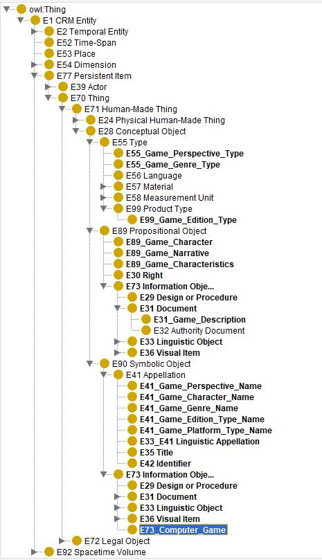

<!--
*titel:
*author:in/urheber:in: 
orcid: 
email: SODa@sammlungen.io
*lizenz: cc by
lizenzlink: https://creativecommons.org/
*persistenter OER link: 
language: 
version:  v1
beschreibung: 
format: SODa WissKI How-to-Tutorial
modultitel: 
modul: Unit 1
einheitstitel: 
eiheit: Einheit 1
lernziel: 

baustein:
zielgruppe: https://zenodo.org/records/15574575
gestaltungsprinzip: 
keywords: ???
erstellungsdatum: 

technische metadaten:
medientyp: text
dateiformat: .md
dauer: 
größe:
software: Web

icon: /assets/SODa-Logo_full.svg

link: https://raw.githubusercontent.com/chastik/WissKI/refs/heads/main/soda.css

-->

# SODa WissKI-ISWC25 Bits

**DEVELOP AND IMPLEMENT YOUR DATA MODEL** 

From diagram to paths - explaining and applying

Unit 2: Domain ontology modelling

From conceptual structure to semantic paths 

Duration: ~ 20 Min.

## Why work in draw.io?

In Session 1, we developed the conceptual foundation of our data model:

* in **Unit 5**, we identified *core entities, relationships, and semantics* of the game domain (Zelda example)
* in **Unit 6**, we extended CIDOC CRM with *domain-specific subclasses* 

Now we visualize this semantic model in draw.io as preparation for WissKI implementation.

Working in draw.io helps us, to...

* define entity classes and their roles
* express relationships as CIDOC CRM properties
* test ontology structure before implementation
* Co-model collaboratively and transparently
* communicate the domain ontology
* maintain clean and consistent semantic logic

*Based on experience, visualizations are not only a meaningful intermediate step but also an essential tool for communicating and negotiating modeling decisions. Diagrams make knowledge visible and support a shared understanding of semantic structures.*

---

## What we are modeling

We are modelling the core entities and their relations semantically correct based on CIDOC CRM:

<table>
  <tr>
    <td></td>
  </tr>
</table>  

<table>
  <tr>
    <td></td>
  </tr>
</table>

Link to the Domain Ontology: http://games.m-e-g-a.org/game_domain.rdf 

---

## Modeling requirements

* Use ontology *classes*, not instances
* Follow *CIDOC CRM mappings* 
* Use *semantic properties* (verbs) for relationships from CIDOC CRM
* reuse *domain-specific subclasses* 
* keep modeling *clean, consistent, and readable*

*Note:* There are different valid approaches to building domain ontologies. Some models introduce both subclasses **and** new properties, others define only **semantic paths using existing CIDOC CRM classes and properties without extending the class hierarchy**, and some combine **subclassing with property reuse**.  
In this tutorial, we follow a **lightweight extension strategy**: we define **domain-specific subclasses** where necessary, while **reusing existing CIDOC CRM properties as much as possible** to remain interoperable and CIDOC-compliant.

---

## Task (Pair Work – 15 min)

* Open the prepared draw.io template
* Model the entities from your domain
* Use for semantic relationships CIDOC CRM properties ([CIDOC CRM specification (v7.1.3)](https://cidoc-crm.org/sites/default/files/cidoc_crm_version_7.1.3.pdf) (Resource: https://cidoc-crm.org/sites/default/files/cidoc_crm_version_7.1.3.pdf))

This modeling step is not just a visual exercise — the diagram is part of an (semi)automated pipeline (web-service).....

Once our domain diagrams are ready, we will transform them into WissKI Paths in the next step.

