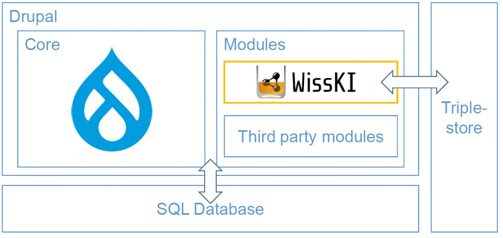

<!--
*titel:
*author:in/urheber:in: 
orcid: 
email: SODa@sammlungen.io
*lizenz: cc by
lizenzlink: https://creativecommons.org/
*persistenter OER link: 
language: 
version:  v1
beschreibung: 
format: SODa WissKI How-to-Tutorial
modultitel: 
modul: Unit 1
einheitstitel: 
eiheit: Einheit 1
lernziel: 

baustein:
zielgruppe: https://zenodo.org/records/15574575
gestaltungsprinzip: 
keywords: ???
erstellungsdatum: 

technische metadaten:
medientyp: text
dateiformat: .md
dauer: 
größe:
software: Web

icon: /assets/SODa-Logo_full.svg

link: https://raw.githubusercontent.com/chastik/WissKI/refs/heads/main/soda.css

-->

# SODa WissKI-ISWC25 Bits

**DEVELOP AND IMPLEMENT YOUR DATA MODEL** 

From diagram to paths - explaining and applying

Unit 3: From draw.io to WissKi Pathbuilder 

Duration: ~ 20 Min.

---

## Why this step matters?

In Unit 2, we modeled **semantic relationships** in draw.io using CIDOC CRM and domain ontology structures.  

However, WissKI does **not** work directly with ontology files – it needs **semantic paths** in order to:

* structure **data entry forms**
* build the **RDF knowledge graph**
* ensure **ontology-compliant data storage**

In this unit, we transform our **draw.io semantic model** into **WissKI Paths** using an automated pipeline.

---

## From ontology relations to WissKI paths

Ontology modeling focuses on describing **classes** and **semantic relations**.  

WissKI implements these connections as **paths** – sequences of ontology properties.

Each semantic chain becomes **one Path** in the WissKI Pathbuilder.

---

### Example

**Ontology relation**

Computer Game → was created in → Creation Event → carried out by → Group

**WissKI Group and Paths**

Computer Game (Group)

  → **P94 was created by** → Creation Event  (Path)
  
  → **P14 carried out by** → Group (Path)

I you would use **E12 Production Event** instead of **E65 Creation Event**, a semantic error would occurs because **E12 Production Event** is not compatible with **P94 was created by**. 

This is exactly where semantic validation is valuable and provides reporting.

---

## What is the Pathbuilder?

The **Pathbuilder** is WissKI’s implementation layer. Instead of relational tables, it uses semantic paths.

<table>
  <tr>
    <td></td>
  </tr>
</table>

| Term | Meaning |
|------|---------|
| **Group** | Entity class (e.g. Game, Person, Event) |
| **Path** | Chain of CIDOC CRM properties |
| **Domain** | Start of the path |
| **Range** | End of the path |
| **Pathbuilder XML** | File used to import semantic paths into WissKI |

Paths define WissKI’s internal ontology structure and are used to generate **data entry forms** and **RDF triples**.

---

## Pipeline: draw.io → Pathbuilder XML

To save time, we use the Pathbuilder Pipeline...

This pipeline can automatically convert draw.io ontology diagrams into WissKI Pathbuilder XML files.

* saves time  
* reuses ontology logic  
* ensures consistency  
* keeps semantic structure intact

---

### Workflow

| Step | Action                               |
| ---- | ------------------------------------ |
| 1    | Export draw.io model as `.xml`       |
| 2    | Upload to pipeline service           |
| 3    | Pipeline verifies ontology structure |
| 4    | Generates **WissKI Pathbuilder XML** |
| 5    | Import XML into WissKI               |
| 6    | Paths appear automatically           |

---

## Hands-on Task (Pair work – 15 min)

Using the diagram you built in Unit 2:

* Export your draw.io file [example draw.io diagram](https://drive.google.com/file/d/1CzgpEMxGYmfUgI2LUh0J-cbfsfW82T3f/view?usp=sharing) as .xml [example draw.io .xml-file](https://isl.ics.forth.gr/gnm_services/files/examples/diagrams_to_pathbuilders/DrawioPathBuilderExampleInput.xml)
* Upload it to the [Draw.io diagrams to WissKI pathbuilders web service](https://isl.ics.forth.gr/gnm_services/drawioXMLtoWisskiPathbuilder/)
* Generate the Pathbuilder XML [example Pathbuilder XML file](https://isl.ics.forth.gr/gnm_services/files/examples/diagrams_to_pathbuilders/DrawioPathBuilderExampleOutput.xml)
* Inspect the created semantic paths
* Download and prepare the generated Pathbuilder XML for import in Unit 4

Now we have a Pathbuilder XML based on your domain model.

--- 

## Background: How the pipeline works

The [FORTH-ICS Web Service](https://isl.ics.forth.gr/gnm_services/):
* parses draw.io diagrams via a **JSON configuration**
* detects **semantic paths** from a **central ontology node**
* checks **syntactic validity** against ontology files
* exports paths as **WissKI Pathbuilder XML**

These XML profiles define **application profiles** in WissKI: they configure entity structure and data entry logic while hiding implementation complexity from users.

*Note:* A future development step may include **semantic validation** (e.g. checking CIDOC CRM domain/range constraints). This would catch invalid ontology mappings before import.

---

## Hands-on task (pair work – 15 min)

* export your draw.io model (`.xml`)
* upload it to the Pathbuilder Pipeline
* generate **Pathbuilder XML**
* inspect the generated **semantic paths**
* download XML → needed for Unit 4

Use this Web Service: https://isl.ics.forth.gr/gnm_services/

Result: You now have a **WissKI-ready semantic path configuration**

