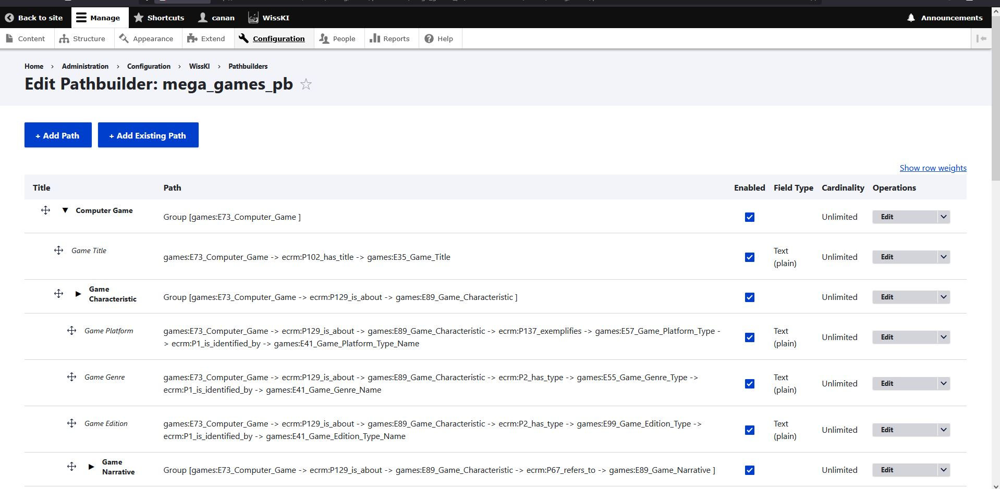

<!--

icon: https://raw.githubusercontent.com/chastik/Beratung_Dateityp_Bild/refs/heads/main/SODa-Logo_full.svg
link: https://raw.githubusercontent.com/chastik/Beratung/refs/heads/main/soda.css

-->

# SODa WissKI-ISWC25 Bits

**DEVELOP AND IMPLEMENT YOUR DATA MODEL** 

From diagram to paths - explaining and applying

Unit 3: From draw.io to WissKi Pathbuilder 

Duration: ~ 20 Min.

---

## Purpose of this Process

In Unit 2, we created semantic relationship models in draw.io based on CIDOC CRM and domain ontologies.

Since WissKI cannot directly interpret ontology files, it requires semantic paths to:

* structure and organize data entry forms,
* build the RDF knowledge graph, and
* guarantee ontology-compliant data storage.

This process bridges the gap between ontology modeling and WissKI’s internal data structure by automatically converting the draw.io semantic model into WissKI Paths through a transformation pipeline.

---

## From ontology relations to WissKI paths

Ontology modeling focuses on describing **classes** and **semantic relations**.  

WissKI implements these connections as **paths** – sequences of ontology properties.

Each semantic chain becomes **one Path** in the WissKI Pathbuilder.

---

### Example

**Ontology relation**

Computer Game → was created in → Creation Event → carried out by → Group

**WissKI Group and Paths**

Computer Game (Group)

  → **P94 was created by** → Creation Event  (Path)
  
  
  → **P14 carried out by** → Group (Path)

If you would use **E12 Production Event** instead of **E65 Creation Event**, a semantic error would occurs because **E12 Production Event** is not compatible with **P94 was created by**. 

This is exactly where semantic validation is valuable and provides reporting.

---

## What is the Pathbuilder?

The **Pathbuilder** is WissKI’s implementation layer. Instead of relational tables, it uses semantic paths.

<table>
  <tr>
    <td></td>
  </tr>
</table>

Paths define WissKI’s internal ontology structure and are used to generate data entry forms and RDF triples — these aspects are covered in more detail in another advanced unit.

---

## Workflow

| Step | Action                               |
| ---- | ------------------------------------ |
| 1    | Export draw.io model as `.xml`       |
| 2    | Upload to WissKI Pathbuilder web service           |
| 3    | Pipeline validates the ontology structure |
| 4    | Generate **WissKI Pathbuilder XML** |

---

## Hands-on Task (Pair work – 15 min)

* Export your draw.io model ([example draw.io diagram](https://drive.google.com/file/d/1CzgpEMxGYmfUgI2LUh0J-cbfsfW82T3f/view?usp=sharing)) as .xml-file ([example draw.io .xml-file](https://isl.ics.forth.gr/gnm_services/files/examples/diagrams_to_pathbuilders/DrawioPathBuilderExampleInput.xml))
* Upload it to the [Draw.io diagrams to WissKI pathbuilders web service](https://isl.ics.forth.gr/gnm_services/drawioXMLtoWisskiPathbuilder/)
* Generate the Pathbuilder XML ([example Pathbuilder XML file](https://isl.ics.forth.gr/gnm_services/files/examples/diagrams_to_pathbuilders/DrawioPathBuilderExampleOutput.xml))
* Inspect the created semantic paths
* Download and prepare the generated Pathbuilder XML for import in Unit 4

Now we have a Pathbuilder XML based on your domain model.

--- 

## Import into WissKI 

Short demonstration of final steps:

| Step | Action                               |
| ---- | ------------------------------------ |
| 5    | Import XML into WissKI               |
| 6    | Paths appear automatically           |

---

## Benefits of draw.io → Pathbuilder XML Pipeline

This pipeline automatically transforms draw.io ontology diagrams into WissKI Pathbuilder XML files, offering several advantages:

* Time efficiency – eliminates manual conversion effort
* Ontology reuse – leverages existing ontology logic
* Consistency – maintains uniform structure across files
* Semantic integrity – preserves the original meaning and relationships

---

## Background: How the pipeline works

The [FORTH-ICS Web Service](https://isl.ics.forth.gr/gnm_services/):
* parses draw.io diagrams via a **JSON configuration**
* detects **semantic paths** from a **central ontology node**
* checks **syntactic validity** against ontology files
* exports paths as **WissKI Pathbuilder XML**

These XML profiles define **application profiles** in WissKI: they configure entity structure and data entry logic while hiding implementation complexity from users.

*Note:* A future development step may include **semantic validation** (e.g. checking CIDOC CRM domain/range constraints). This would catch invalid ontology mappings before import.

---

