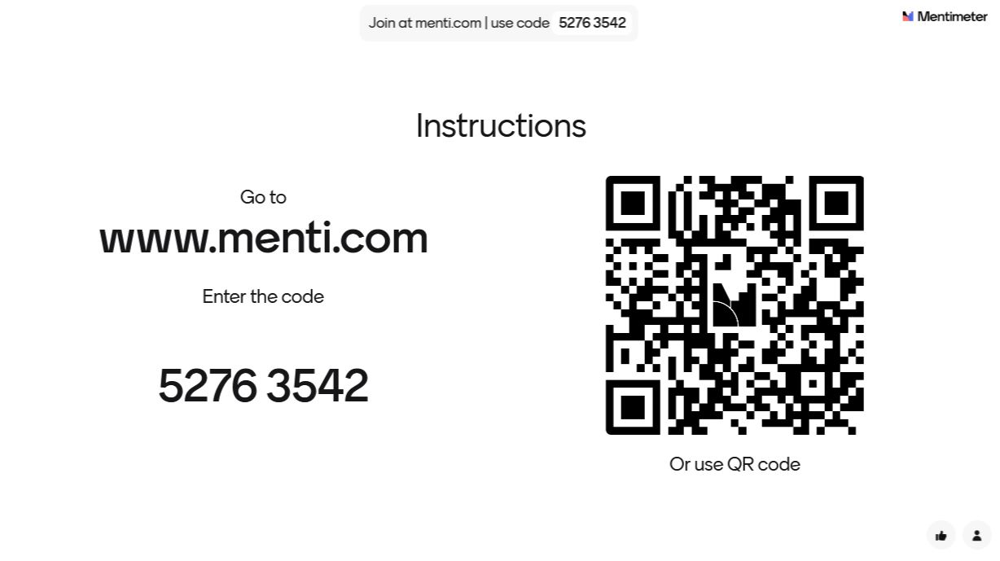

<!--
*titel:
*author:in/urheber:in: 
orcid: 
email: SODa@sammlungen.io
*lizenz: cc by
lizenzlink: https://creativecommons.org/
*persistenter OER link: 
language: 
version:  v1
beschreibung: 
format: SODa WissKI How-to-Tutorial
modultitel: 
modul: Unit 1
einheitstitel: 
eiheit: Einheit 1
lernziel: 

baustein:
zielgruppe: https://zenodo.org/records/15574575
gestaltungsprinzip: 
keywords: ???
erstellungsdatum: 

technische metadaten:
medientyp: text
dateiformat: .md
dauer: 
größe:
software: Web

icon: /assets/SODa-Logo_full.svg

link: https://raw.githubusercontent.com/chastik/WissKI/refs/heads/main/soda.css

-->
# SODa WissKI-ISWC25 Bits

**DEVELOP AND IMPLEMENT YOUR DATA MODEL** 

From diagram to paths - explaining and applying

Unit 6: Farewell and Feedback

Duration: ~ 15 Min.

---

## Quick Feedback

This session reflects on the **modeling process so far**, let us discuss...

* What worked well ?
* What was challenging ?
* Where uncertainties remain ?
* Wnd how confident you feel moving forward into WissKI implementation ?

--

## Your Feedback is valuable

<table>
  <tr>
    <td></td>
  </tr>
</table>

---

## ## Open Discussion Impulses

These are reflection questions for the group, best discussed together in plenary form.

---

### Understanding & Process

* What was your biggest *Aha!* moment today?
* What helped you understand the idea of **semantic modeling**?
* Did you feel a shift from a **data entry mindset** to **knowledge modeling**?

---

### Application to Real Projects

* Where can you apply this workflow in your work?
* Does this approach make sense in your institution or data context?
* Which part of your current projects would benefit from **explicit semantics**?

---

### Modeling Perspective

* What do you think is more challenging: **choosing classes** or **defining relationships**?
* How did your thinking change when moving from **concept map → ontology**?
* Do you see ontology as a **documentation method** or a **technical solution**?

---

### Motivation & Outlook

* Do you think **Linked Open Data (LOD)** is relevant for your domain?
* What would help you continue working with **semantic modeling**?
* Which area would you like to explore next:
  
  * ontology modeling
  * automation & pipelines
  * WissKI implementation
  * SPARQL querying / knowledge graphs

